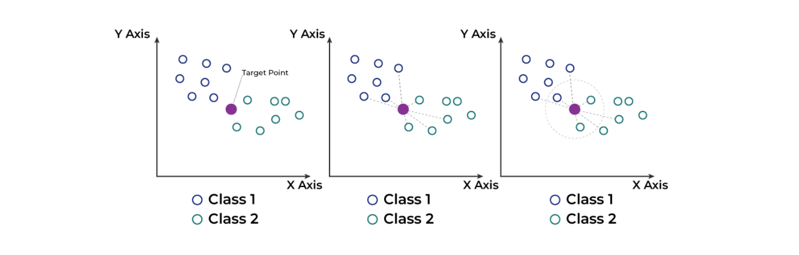

# K_Nearest_Neighbors_Algorithm

Implemented for the purposes of the Machine Learning course at FIT Mostar.

# About algorithm

K-Nearest Neighbors is supervised machine learing method that is used for classification and regression problems.The K-NN algorithm works by finding the K nearest neighbors to a given data point based on a distance metric, such as Euclidean distance. The class or value of the data point is then determined by the majority vote or average of the K neighbors. This approach allows the algorithm to adapt to different patterns and make predictions based on the local structure of the data.

 

# Project

In this project we use K-NN algorithm to classify students in two classes 0 or 1 according to their grade increase in subjects PRI,PRII,PRIII.
For example if student has <b>PRI-6</b>, <b>PRII-7</b>,<b>PRIII-8</b> the student will be classified in class <b>1</b>, which means he got <b>increase</b> in his marks from those particular subjects. That could be useful for university managment to recognize a possible improvments/problems and to properly act with them.
 

